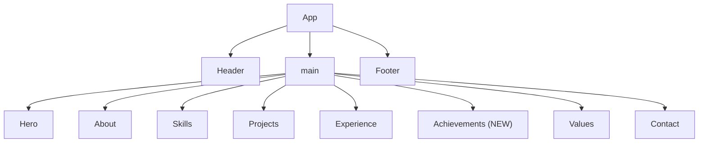

# Design Document — Portfolio Upgrade

## Overview

This design covers the content enrichment and structural improvements required to upgrade Dinesh Ramar's existing React + Vite + TypeScript + Tailwind CSS portfolio to present him as a senior Frontend React Developer with 4+ years of enterprise experience. The upgrade touches ten files: eight existing components and `index.html`, plus one new component (`Achievements.tsx`). No new runtime dependencies are introduced, the existing Design System (tokens, fonts, component API) is preserved unchanged, and WCAG 2.1 AA compliance is maintained throughout.

### Research Summary

The project uses a well-established stack:
- **React 19 + TypeScript 5.9** — strict JSX, no `any` in component props
- **Tailwind CSS 3.4** with custom design tokens defined as HSL CSS custom properties
- **shadcn/ui-style components** — `Button`, `Card`, `Badge`, `ThemeToggle` — each already supports `asChild`, `variant`, and `cn()` composition
- **lucide-react** for icons (already a dependency — safe to use for any new icon needs)
- **`cn()` from `src/lib/utils.ts`** — `clsx` + `twMerge`, must be used for all conditional class composition

All data arrays (highlight cards, skill groups, project details, achievement metrics, experience bullets) will be extracted as module-level `const` declarations outside component functions, satisfying Requirement 10.6 and avoiding re-creation on every render.

---

## Architecture

The upgrade is a pure content and markup change within the existing single-page application. No routing, state management, or data-fetching changes are needed. The component tree remains:

```
App
├── Header          ← add nav anchor links (hidden on mobile)
├── main#main
│   ├── Hero        ← new title, subtitle, description, 8 highlight cards
│   ├── About       ← achievement-led rewrite
│   ├── Skills      ← 5 categories
│   ├── Projects    ← 4 professional project cards
│   ├── Experience  ← quantified bullets
│   ├── Achievements  ← NEW component (6 metric cards)
│   ├── Values      ← unchanged
│   └── Contact     ← updated CTA text
└── Footer          ← add tech-stack attribution
```

`index.html` receives only `<head>` additions (SEO meta tags); no structural body changes.



---

## Components and Interfaces

### 1. `Hero.tsx` — upgraded

```typescript
// Module-level data (extracted outside component)
interface HighlightCard {
  label: string
}

const HIGHLIGHT_CARDS: HighlightCard[] = [
  { label: "4+ Years Experience" },
  { label: "10+ React UI Modules Delivered" },
  { label: "25% Bundle Size Reduction" },
  { label: "90+ Lighthouse Accessibility" },
  { label: "5+ Secure REST API Integrations" },
  { label: "WCAG 2.1 AA" },
  { label: "VAPT Remediation" },
  { label: "Banking Domain Experience" },
]
```

JSX structure additions below the description `<p>`:
- `<div>` with `aria-label="Quick Highlights"` wrapping a `flex flex-wrap gap-2 justify-center` container
- Each card: `<div className="rounded-lg border bg-card text-card-foreground px-3 py-2 text-sm font-medium">` (uses existing card/border tokens, no new CSS properties)
- Existing `View Projects` and `Download Resume` buttons preserved with their current `aria-label` values

Responsive behaviour for highlight cards:
- `flex flex-wrap gap-2 justify-center` — cards wrap naturally from 320 px upwards with no horizontal overflow down to 320 px (native `flex-wrap`)

### 2. `About.tsx` — rewritten

```typescript
interface SpecialisationItem {
  title: string
  description: string
}

const SPECIALISATIONS: SpecialisationItem[] = [
  { title: "Enterprise Banking Applications", description: "..." },
  { title: "React Architecture", description: "..." },
  { title: "Performance Optimisation", description: "25% bundle size reduction..." },
  { title: "WCAG 2.1 AA Accessibility", description: "..." },
  { title: "VAPT-Aware Secure Frontend", description: "..." },
  { title: "Agile Collaboration", description: "..." },
  { title: "Reusable Component Development", description: "..." },
]
```

Opening paragraph references enterprise banking, React component architecture, and accessibility-first practices. All bullet items lead with a domain-specific or quantified statement. Prohibited phrases ("actively transitioning", language implying junior status) are not present.

### 3. `Skills.tsx` — 5-category upgrade

```typescript
interface SkillGroup {
  title: string
  skills: string[]
}

const SKILL_GROUPS: SkillGroup[] = [
  { title: "Frontend", skills: ["React.js","TypeScript","JavaScript","HTML5","CSS3","Tailwind CSS","Bootstrap"] },
  { title: "React Ecosystem", skills: ["Redux Toolkit","React Query","React Router","Context API","Custom Hooks","React.memo"] },
  { title: "Performance", skills: ["Lazy Loading","Code Splitting","Lighthouse","Bundle Optimization"] },
  { title: "Quality", skills: ["WCAG 2.1 AA","VAPT","Cross-browser Compatibility","ESLint","Prettier"] },
  { title: "Tools", skills: ["Git","GitHub","Vite","Webpack","npm","CI/CD"] },
]
```

Grid layout:
- `grid-cols-1` (< 768 px)
- `md:grid-cols-2` (768–1023 px)
- `lg:grid-cols-3 xl:grid-cols-5` (≥ 1024 px, at least 3 columns as required)

Each skill: `<Badge variant="secondary">`.

### 4. `Projects.tsx` — 4-card replacement

```typescript
interface ProjectMetric {
  label: string
}

interface ProjectCard {
  id: string
  title: string
  role: string
  overview: string
  responsibilities: string[]
  metrics: ProjectMetric[]
  techStack: string[]
  demoUrl?: string
  githubUrl?: string
}

const PROJECTS: ProjectCard[] = [
  {
    id: "ujjivan",
    title: "Ujjivan Small Finance Bank",
    role: "Frontend React Developer",
    overview: "Enterprise banking application built on Drupal CMS...",
    responsibilities: [
      "Built reusable React components for customer banking workflows",
      "Integrated secure REST APIs with proper error handling",
      "Improved accessibility to achieve 90+ Lighthouse Accessibility score",
      "Completed VAPT remediation before every production release",
      "Optimised frontend performance reducing bundle size by 25%",
    ],
    metrics: [
      { label: "90+ Lighthouse Accessibility" },
      { label: "Production banking application" },
      { label: "Secure deployment" },
    ],
    techStack: ["React","Drupal","JavaScript","REST API","Bootstrap"],
  },
  {
    id: "workforce",
    title: "Employee Workforce Analytics Dashboard",
    role: "Frontend React Developer",
    overview: "...",
    responsibilities: [...],
    metrics: [...],
    techStack: ["React","TypeScript","React Query","Context API","Tailwind CSS"],
  },
  {
    id: "xerago",
    title: "Xerago Website",
    role: "Frontend React Developer",
    overview: "...",
    responsibilities: [...],
    metrics: [...],
    techStack: ["React","Redux Toolkit","Tailwind CSS","Lazy Loading","SEO"],
  },
  {
    id: "saas",
    title: "SaaS Admin Dashboard",
    role: "Frontend React Developer",
    overview: "A modern, high-performance SaaS Admin Dashboard built with React, Vite, and Tailwind CSS...",
    responsibilities: [
      "Responsive layout with sidebar and navbar optimized for all screen sizes",
      "Dark mode support with full theme-aware color system",
      "WCAG 2.1 AA compliant with high-contrast accessibility",
      "Performance optimized with route-based code splitting and lazy loading",
    ],
    metrics: [{ label: "70% bundle size reduction" }],
    techStack: ["React","Vite","Tailwind CSS","Recharts","Context API"],
    demoUrl: "https://saa-s-admin-dashboard-seven.vercel.app",
    githubUrl: "https://github.com/dinesh-ramar/SaaS_Admin_Dashboard",
  },
]
```

Grid: `md:grid-cols-2` at ≥ 768 px, single column below. All content inline — no routing required.

### 5. `Experience.tsx` — quantified bullets

```typescript
interface ExperienceBullet {
  text: string
}

const EXPERIENCE_BULLETS: ExperienceBullet[] = [
  { text: "Delivered 10+ production-ready React modules across enterprise banking and corporate websites, adopted by multiple project teams." },
  { text: "Reduced JavaScript bundle size by 25% through code splitting, lazy loading, and tree-shaking optimisations." },
  { text: "Achieved Lighthouse Accessibility scores above 90 by implementing WCAG 2.1 AA standards, semantic HTML, and keyboard navigation." },
  { text: "Integrated 5+ secure REST APIs with proper token handling, error boundaries, and input validation." },
  { text: "Completed VAPT remediation before every production release, resolving all high-severity frontend vulnerabilities." },
  { text: "Built a reusable React component library adopted across three enterprise applications, cutting development time for new features." },
]
```

Role: "Frontend React Developer", Employer: "Xerago, Chennai", Date: "2021 – Present". No generic phrases.

### 6. `Achievements.tsx` — NEW component

```typescript
interface AchievementCard {
  metric: string
  label: string
}

const ACHIEVEMENT_CARDS: AchievementCard[] = [
  { metric: "4+", label: "Years Experience" },
  { metric: "10+", label: "React Modules" },
  { metric: "25%", label: "Bundle Reduction" },
  { metric: "90+", label: "Accessibility Score" },
  { metric: "5+", label: "REST APIs" },
  { metric: "100%", label: "VAPT Compliance" },
]
```

Each card displays `metric` in a large font (`text-3xl font-bold text-primary`) and `label` below it (`text-sm text-muted-foreground`). Grid: `grid-cols-2 md:grid-cols-3`.

### 7. `Contact.tsx` — CTA text update

Only the description `<p>` text changes to: *"Interested in building scalable, secure, and accessible React applications together? I'm open to Frontend React opportunities, freelance work, and enterprise projects."*. All buttons (`mailto:`, GitHub, LinkedIn) with their existing `aria-label` values and `href` values are preserved unchanged.

### 8. `Footer.tsx` — attribution addition

Add a second `<p>` (or inline `·` separator in the same `<p>`) below/alongside the copyright: `Built with React + Vite + Tailwind CSS` styled `text-sm text-muted-foreground`.

### 9. `Header.tsx` — nav anchor links

```typescript
interface NavLink {
  label: string
  href: string
}

const NAV_LINKS: NavLink[] = [
  { label: "About", href: "#about" },
  { label: "Skills", href: "#skills" },
  { label: "Projects", href: "#projects" },
  { label: "Experience", href: "#experience" },
  { label: "Contact", href: "#contact" },
]
```

Nav links rendered with `hidden md:flex` so they are invisible below 768 px. Each `<a>` uses:
```
className="text-sm font-medium text-muted-foreground hover:text-foreground
           focus-visible:outline-none focus-visible:ring-2 focus-visible:ring-primary
           focus-visible:ring-offset-2 rounded-sm transition-colors"
```
Skip-link and `ThemeToggle` are preserved unchanged.

### 10. `App.tsx` — Achievements insertion

```tsx
<Experience />
<Achievements />   {/* NEW — inserted here */}
<Values />
<Contact />
```

### 11. `index.html` — SEO meta tags

Added inside `<head>` before the closing tag:
```html
<meta name="description" content="Dinesh Ramar — React Frontend Developer with 4+ years building TypeScript and enterprise applications. Specialised in accessibility, performance, and security-first development." />
<meta name="keywords" content="React.js, TypeScript, Redux Toolkit, Frontend Developer, React Developer, Tailwind CSS, WCAG, enterprise frontend" />
<meta name="author" content="Dinesh Ramar" />
<meta property="og:title" content="Dinesh Ramar — Frontend React Developer" />
<meta property="og:description" content="Frontend React Developer with 4+ years of experience building secure, scalable, and accessible enterprise applications." />
```

All existing tags (viewport, charset, Google Fonts preconnect, FOUC-prevention inline script) are preserved.

---

## Data Models

All data is static and lives as module-level typed `const` arrays. No runtime state management is needed for the upgraded content.

```typescript
// Shared pattern for all sections
interface HighlightCard { label: string }
interface AchievementCard { metric: string; label: string }
interface SkillGroup { title: string; skills: string[] }
interface SpecialisationItem { title: string; description: string }
interface ExperienceBullet { text: string }
interface ProjectMetric { label: string }
interface ProjectCard {
  id: string
  title: string
  role: string
  overview: string
  responsibilities: string[]
  metrics: ProjectMetric[]
  techStack: string[]
  demoUrl?: string
  githubUrl?: string
}
interface NavLink { label: string; href: string }
```

All interfaces are defined in the files that consume them (co-location pattern matching the existing codebase). No separate `types.ts` file is introduced unless colocation becomes unwieldy.

---

## Correctness Properties

*A property is a characteristic or behavior that should hold true across all valid executions of a system — essentially, a formal statement about what the system should do. Properties serve as the bridge between human-readable specifications and machine-verifiable correctness guarantees.*

The feature involves static React components rendering typed data arrays. PBT applies here because:
- Rendering functions have clear input/output behavior (props/data → rendered markup)
- Universal properties hold across all items in a data array (every card, every bullet, every skill)
- Input variation (array contents, component states) reveals missing items or wrong markup
- Tests are pure, in-memory, and cost-effective to run 100+ times

**Property-based testing library**: [fast-check](https://fast-check.dev/) with [Vitest](https://vitest.dev/) and [@testing-library/react](https://testing-library.com/docs/react-testing-library/intro/).

---

### Property 1: Hero highlight cards completeness

*For any* render of the `Hero` component, all eight required Quick Highlights labels (`"4+ Years Experience"`, `"10+ React UI Modules Delivered"`, `"25% Bundle Size Reduction"`, `"90+ Lighthouse Accessibility"`, `"5+ Secure REST API Integrations"`, `"WCAG 2.1 AA"`, `"VAPT Remediation"`, `"Banking Domain Experience"`) SHALL appear in the rendered output.

**Validates: Requirements 1.4**

---

### Property 2: Hero CTA buttons preserve aria-labels

*For any* render of the `Hero` component, both the "View Projects" button (with `aria-label="View my projects"`) and the "Download Resume" link (with `aria-label="Download resume PDF"`) SHALL be present in the rendered output with their exact aria-label values.

**Validates: Requirements 1.6**

---

### Property 3: About content completeness

*For any* render of the `About` component, the full rendered text SHALL contain references to all required specialisation areas: enterprise banking, React architecture, the 25% bundle size reduction metric, WCAG 2.1 AA, VAPT, Agile collaboration, and reusable component development. Every bullet item SHALL contain at least one quantified term (a number, percentage, or domain-specific technology keyword).

**Validates: Requirements 2.2, 2.3**

---

### Property 4: About prohibited phrases absent

*For any* render of the `About` component, the rendered text SHALL NOT contain any of the following phrases: `"actively transitioning"`, `"junior"`, `"helped to"`, `"assisted with"`, `"working towards"`.

**Validates: Requirements 2.4**

---

### Property 5: Skills categorisation completeness

*For any* render of the `Skills` component, exactly five category cards SHALL be present with titles `["Frontend", "React Ecosystem", "Performance", "Quality", "Tools"]`, each containing all its required skills with no duplicates, and every skill SHALL be rendered as a `Badge` element carrying the `secondary` variant class.

**Validates: Requirements 3.1, 3.2, 3.3, 3.4, 3.5, 3.6, 3.9**

---

### Property 6: Project card completeness

*For any* render of the `Projects` component, exactly four project cards SHALL be present with titles `["Ujjivan Small Finance Bank", "Employee Workforce Analytics Dashboard", "Xerago Website", "SaaS Admin Dashboard"]`, and each card SHALL contain a visible role label, overview paragraph, at least one responsibility item, at least one metric, and at least one tech-stack badge.

**Validates: Requirements 4.1, 4.2**

---

### Property 7: Experience bullet quality

*For any* bullet in the rendered `Experience` component, the bullet text SHALL begin with a past-tense action verb (from the set: `"Delivered"`, `"Reduced"`, `"Achieved"`, `"Integrated"`, `"Completed"`, `"Built"`, and equivalents), and the full set of bullets SHALL collectively cover: React modules delivery, bundle size reduction (25%), Lighthouse Accessibility (90+), REST API integration (5+), VAPT remediation, and reusable component development.

**Validates: Requirements 5.2, 5.3**

---

### Property 8: Experience prohibited phrases absent

*For any* render of the `Experience` component, the rendered text SHALL NOT contain any of: `"worked on"`, `"assisted with"`, `"helped to"`, `"working on"`.

**Validates: Requirements 5.4**

---

### Property 9: Achievements card completeness

*For any* render of the `Achievements` component, exactly six cards SHALL be present, each card SHALL display both a short metric value element and a descriptive label element, and the six metric values SHALL be `["4+", "10+", "25%", "90+", "5+", "100%"]` with their corresponding labels.

**Validates: Requirements 6.2, 6.3**

---

### Property 10: Contact buttons preserved

*For any* render of the `Contact` component, three interactive elements SHALL be present: one with `href="mailto:dineshramar413@gmail.com"` and `aria-label="Send email to Dinesh Ramar"`, one with `href` pointing to the GitHub profile and `aria-label="Visit Dinesh Ramar's GitHub profile"`, and one with `href` pointing to the LinkedIn profile and `aria-label="Visit Dinesh Ramar's LinkedIn profile"`.

**Validates: Requirements 7.3**

---

### Property 11: Footer attribution token correctness

*For any* render of the `Footer` component, the "Built with React + Vite + Tailwind CSS" attribution text element SHALL carry the `text-muted-foreground` Tailwind class.

**Validates: Requirements 8.2**

---

### Property 12: Header nav link integrity

*For any* render of the `Header` component, exactly five anchor elements targeting `["#about", "#skills", "#projects", "#experience", "#contact"]` SHALL be present, each `href` SHALL start with `"#"`, and each element SHALL carry the `focus-visible:ring-primary` focus indicator classes.

**Validates: Requirements 9.1, 9.2, 9.4**

---

### Property 13: Header structural preservation

*For any* render of the `Header` component, the "Skip to main content" skip-link and the `ThemeToggle` component SHALL both be present in the rendered output.

**Validates: Requirements 9.5**

---

### Property 14: Semantic structure and section id completeness

*For any* render of the full `App` component, all five semantic section `id` attributes (`"about"`, `"skills"`, `"projects"`, `"experience"`, `"contact"`) SHALL be present in the DOM, matching the nav link fragments used in the `Header`.

**Validates: Requirements 10.1, 10.2**

---

### Property 15: Icon-only interactives have aria-labels

*For any* interactive element (button or anchor) in the rendered portfolio that contains no visible text content (icon-only), an `aria-label` attribute SHALL be present and non-empty.

**Validates: Requirements 10.4**

---

### Property 16: index.html preserves required existing elements

*For any* valid build of the project, `index.html` SHALL still contain: the `charset` meta tag, the `viewport` meta tag, the Google Fonts `preconnect` links, and the FOUC-prevention inline script block.

**Validates: Requirements 11.5**

---

## Error Handling

### TypeScript Strictness

- All component props and data interfaces are fully typed — no `any`.
- Optional properties (`demoUrl?`, `githubUrl?`) use proper null-coalescing in JSX: `{card.demoUrl && <Button ...>}`
- `tsc --noEmit` must pass with zero errors (Requirement 10.7).

### Missing Data Guards

Each data array is a module-level `const` with fixed values, so runtime absence is impossible. No loading/error states are needed.

### Anchor Link Safety

All external links (`target="_blank"`) include `rel="noopener noreferrer"` to prevent tab-napping and referrer leakage (preserved from existing patterns).

### Accessibility Error Prevention

- Every `` (if any are added) must have an `alt` attribute.
- All icon-only buttons/links must have `aria-label`.
- No `aria-*` attributes are added to non-interactive elements.

---

## Testing Strategy

### Dual Testing Approach

Both **unit/example-based tests** and **property-based tests** are used. Unit tests cover specific content assertions and structural checks; property tests verify universal invariants across all items in data arrays.

### Tooling

| Tool | Purpose |
|------|---------|
| [Vitest](https://vitest.dev/) | Test runner (already available via Vite ecosystem) |
| [@testing-library/react](https://testing-library.com/docs/react-testing-library/intro/) | Component rendering and DOM queries |
| [fast-check](https://fast-check.dev/) | Property-based test generation |
| `tsc --noEmit` | TypeScript zero-error verification |

> Note: Vitest and @testing-library/react are not currently in `package.json`. They would be added as `devDependencies` only (no runtime dependency introduced, satisfying Requirement 10.5). fast-check is also a devDependency.

### Unit / Example-Based Tests

Focused on:
- Specific static strings (h1 title, subtitle, description paragraph, contact CTA)
- Specific href values (email, GitHub, LinkedIn)
- SEO meta tag content in `index.html`
- Achievements component placement in App tree
- SaaS project demo/GitHub URLs preserved

Each test corresponds to a single concrete example.

### Property-Based Tests

Each property from the Correctness Properties section maps to **one property-based test** with a minimum of 100 iterations. Since the components render static data (no random input), the properties are tested by:

1. **Data array coverage**: `fc.constantFrom(...ITEMS)` to sample individual items and assert their rendered output satisfies the property.
2. **Full-render assertions**: Render the full component once, then use `fc.property` with generators over the expected item set to assert each item satisfies its invariant.

Tag format for each test:
```
// Feature: portfolio-upgrade, Property N: <property_text>
```

Example:

```typescript
// Feature: portfolio-upgrade, Property 5: Skills categorisation completeness
it('every skill renders as Badge with secondary variant', () => {
  fc.assert(
    fc.property(
      fc.constantFrom(...SKILL_GROUPS.flatMap(g => g.skills)),
      (skill) => {
        const { getByText } = render(<Skills />)
        const badge = getByText(skill).closest('[class*="secondary"]')
        expect(badge).not.toBeNull()
      }
    ),
    { numRuns: 100 }
  )
})
```

### Unit Testing Balance

Unit tests are written only for:
- Specific example assertions (e.g. h1 text, meta tag values)
- Integration points (App tree structure, Achievements insertion point)
- Edge cases (optional project links render conditionally)

Property tests cover the universal invariants across all data items, avoiding the need to write one unit test per bullet, skill, or card.

### TypeScript Verification

```bash
tsc --noEmit
```

Run after every file change. Zero errors required before task completion.

### Accessibility Verification

Manual review with keyboard navigation and screen reader (VoiceOver / NVDA) is required for:
- Focus ring visibility on all interactive elements
- Skip-link functionality
- Screen reader announcement of section headings

> Full WCAG 2.1 AA validation requires manual testing with assistive technologies and expert accessibility review — automated tools catch ~30–40% of issues.
